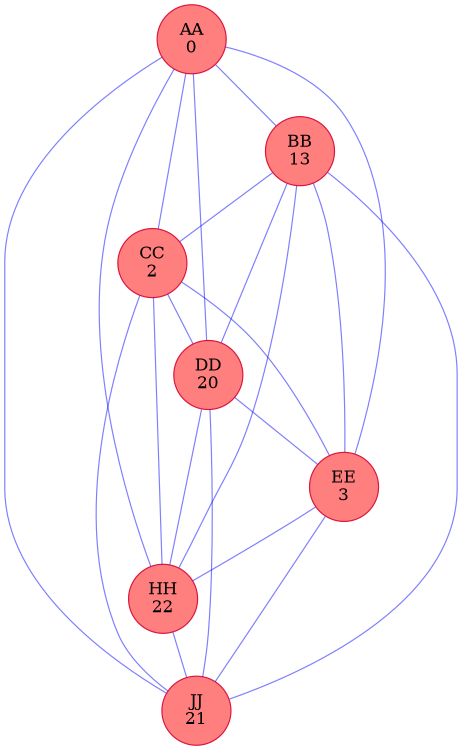
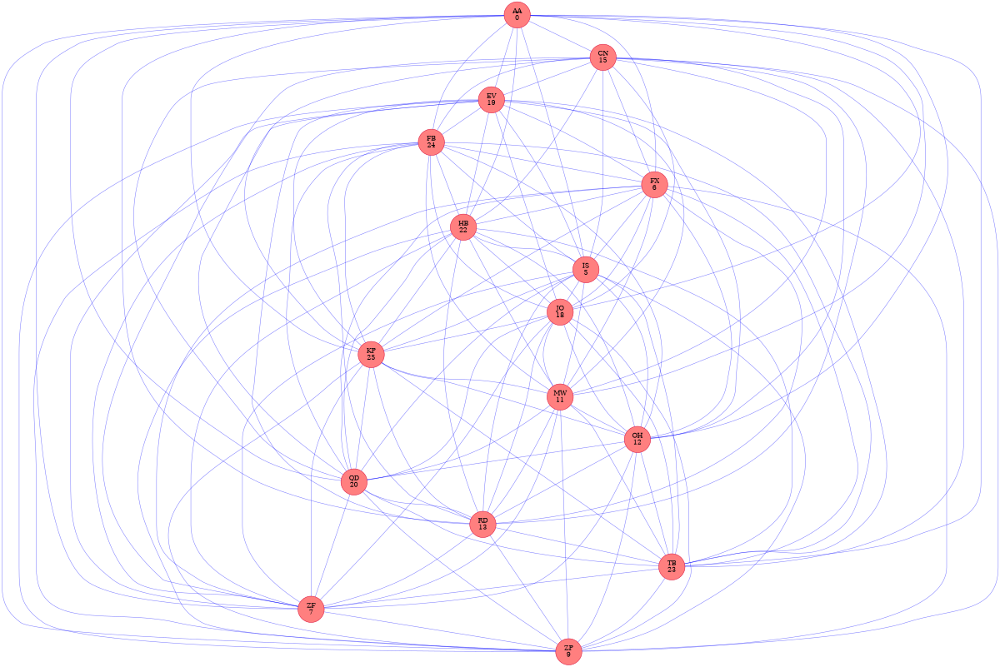

# 2022 AOC Day 16 Graphs

```dot {align=center, engine=neato}
graph{
size="5,5"
model=mds
node [shape=circle, fixedsize=true, width=0.8, style=filled]
node [color=crimson, fillcolor="#ff000080"]
edge [color="#0000ff80"]


AA [label="AA\n0"]
BB [label="BB\n13"]
CC [label="CC\n2"]
DD [label="DD\n20"]
EE [label="EE\n3"]
HH [label="HH\n22"]
JJ [label="JJ\n21"]

AA -- BB [len=1] // label=1
AA -- CC [len=2] // label=2
AA -- DD [len=1] // label=1
AA -- EE [len=2] // label=2
AA -- HH [len=5] // label=5
AA -- JJ [len=2] // label=2
BB -- CC [len=1] // label=1
BB -- DD [len=2] // label=2
BB -- EE [len=3] // label=3
BB -- HH [len=6] // label=6
BB -- JJ [len=3] // label=3
CC -- DD [len=1] // label=1
CC -- EE [len=2] // label=2
CC -- HH [len=5] // label=5
CC -- JJ [len=4] // label=4
DD -- EE [len=1] // label=1
DD -- HH [len=4] // label=4
DD -- JJ [len=3] // label=3
EE -- HH [len=3] // label=3
EE -- JJ [len=4] // label=4
HH -- JJ [len=7] // label=7
}
```

```dot {align=center, engine=neato}
graph {
size="8,8"
model=mds
node [shape=circle, fixedsize=true, width=0.8, style=filled]
node [color=crimson, fillcolor="#ff000080"]
edge [color="#0000ff80"]

AA [label="AA\n0"]
CN [label="CN\n15"]
EV [label="EV\n19"]
FB [label="FB\n24"]
FX [label="FX\n6"]
HB [label="HB\n22"]
IS [label="IS\n5"]
JO [label="JO\n18"]
KP [label="KP\n25"]
MW [label="MW\n11"]
OH [label="OH\n12"]
QD [label="QD\n20"]
RD [label="RD\n13"]
TB [label="TB\n23"]
ZF [label="ZF\n7"]
ZP [label="ZP\n9"]
AA -- CN [len=7] // label=7
AA -- EV [len=6] // label=6
AA -- FB [len=9] // label=9
AA -- FX [len=2] // label=2
AA -- HB [len=9] // label=9
AA -- IS [len=3] // label=3
AA -- JO [len=4] // label=4
AA -- KP [len=7] // label=7
AA -- MW [len=2] // label=2
AA -- OH [len=5] // label=5
AA -- QD [len=4] // label=4
AA -- RD [len=8] // label=8
AA -- TB [len=10] // label=10
AA -- ZF [len=2] // label=2
AA -- ZP [len=2] // label=2
CN -- EV [len=2] // label=2
CN -- FB [len=5] // label=5
CN -- FX [len=9] // label=9
CN -- HB [len=2] // label=2
CN -- IS [len=7] // label=7
CN -- JO [len=3] // label=3
CN -- KP [len=6] // label=6
CN -- MW [len=5] // label=5
CN -- OH [len=5] // label=5
CN -- QD [len=8] // label=8
CN -- RD [len=8] // label=8
CN -- TB [len=10] // label=10
CN -- ZF [len=9] // label=9
CN -- ZP [len=9] // label=9
EV -- FB [len=3] // label=3
EV -- FX [len=8] // label=8
EV -- HB [len=4] // label=4
EV -- IS [len=6] // label=6
EV -- JO [len=2] // label=2
EV -- KP [len=5] // label=5
EV -- MW [len=4] // label=4
EV -- OH [len=3] // label=3
EV -- QD [len=6] // label=6
EV -- RD [len=6] // label=6
EV -- TB [len=8] // label=8
EV -- ZF [len=8] // label=8
EV -- ZP [len=8] // label=8
FB -- FX [len=11] // label=11
FB -- HB [len=7] // label=7
FB -- IS [len=9] // label=9
FB -- JO [len=5] // label=5
FB -- KP [len=8] // label=8
FB -- MW [len=7] // label=7
FB -- OH [len=6] // label=6
FB -- QD [len=9] // label=9
FB -- RD [len=9] // label=9
FB -- TB [len=11] // label=11
FB -- ZF [len=11] // label=11
FB -- ZP [len=11] // label=11
FX -- HB [len=11] // label=11
FX -- IS [len=2] // label=2
FX -- JO [len=6] // label=6
FX -- KP [len=9] // label=9
FX -- MW [len=4] // label=4
FX -- OH [len=6] // label=6
FX -- QD [len=3] // label=3
FX -- RD [len=9] // label=9
FX -- TB [len=11] // label=11
FX -- ZF [len=2] // label=2
FX -- ZP [len=2] // label=2
HB -- IS [len=9] // label=9
HB -- JO [len=5] // label=5
HB -- KP [len=8] // label=8
HB -- MW [len=7] // label=7
HB -- OH [len=7] // label=7
HB -- QD [len=10] // label=10
HB -- RD [len=10] // label=10
HB -- TB [len=12] // label=12
HB -- ZF [len=11] // label=11
HB -- ZP [len=11] // label=11
IS -- JO [len=4] // label=4
IS -- KP [len=7] // label=7
IS -- MW [len=2] // label=2
IS -- OH [len=5] // label=5
IS -- QD [len=4] // label=4
IS -- RD [len=8] // label=8
IS -- TB [len=10] // label=10
IS -- ZF [len=2] // label=2
IS -- ZP [len=2] // label=2
JO -- KP [len=3] // label=3
JO -- MW [len=2] // label=2
JO -- OH [len=5] // label=5
JO -- QD [len=8] // label=8
JO -- RD [len=8] // label=8
JO -- TB [len=10] // label=10
JO -- ZF [len=6] // label=6
JO -- ZP [len=6] // label=6
KP -- MW [len=5] // label=5
KP -- OH [len=8] // label=8
KP -- QD [len=11] // label=11
KP -- RD [len=11] // label=11
KP -- TB [len=13] // label=13
KP -- ZF [len=9] // label=9
KP -- ZP [len=9] // label=9
MW -- OH [len=3] // label=3
MW -- QD [len=6] // label=6
MW -- RD [len=6] // label=6
MW -- TB [len=8] // label=8
MW -- ZF [len=4] // label=4
MW -- ZP [len=4] // label=4
OH -- QD [len=3] // label=3
OH -- RD [len=3] // label=3
OH -- TB [len=5] // label=5
OH -- ZF [len=5] // label=5
OH -- ZP [len=6] // label=6
QD -- RD [len=6] // label=6
QD -- TB [len=8] // label=8
QD -- ZF [len=2] // label=2
QD -- ZP [len=3] // label=3
RD -- TB [len=2] // label=2
RD -- ZF [len=8] // label=8
RD -- ZP [len=9] // label=9
TB -- ZF [len=10] // label=10
TB -- ZP [len=11] // label=11
ZF -- ZP [len=3] // label=3
}
```
